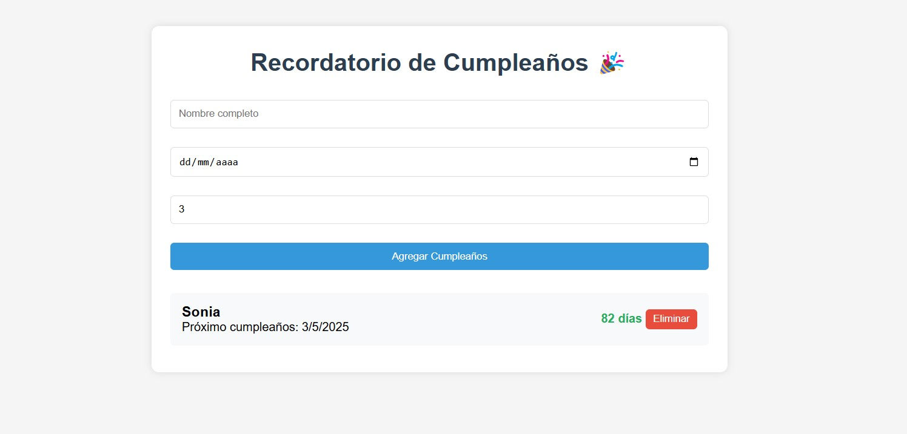

# Recordatorio de Cumpleaños 🎂

Aplicación web para gestionar cumpleaños con recordatorios automáticos. Desarrollada con **HTML**, **CSS** y **JavaScript** puro.

## Características Principales
✅ **Registro de Cumpleaños**  
- Nombre del festejado  
- Fecha de nacimiento  
- Días previos para recibir aviso  

🔔 **Sistema de Recordatorios**  
- Alertas visuales en la interfaz  
- Notificaciones emergentes  
- Verificación automática cada minuto  

🗃️ **Persistencia de Datos**  
- Almacenamiento local en el navegador  
- Datos persistentes después de cerrar la sesión  

🎨 **Interfaz Amigable**  
- Diseño responsive  
- Efectos hover en elementos  
- Resaltado de eventos próximos  
- Botones interactivos  

## Cómo Usar
1. **Agregar Cumpleaños**  
   - Completa el formulario  
   - Establece días de anticipación  
   - Haz clic en *"Agregar Cumpleaños"*

2. **Visualización**  
   - Lista ordenada por proximidad  
   - Días restantes visibles  
   - Tarjetas destacadas para eventos próximos  

3. **Gestión**  
   - Eliminar registros con un clic  
   - Notificaciones automáticas en el navegador  

## Tecnologías Utilizadas
- **Frontend**: HTML5, CSS3, JavaScript ES6  
- **Persistencia**: `localStorage`  
- **Estilos**: Diseño moderno con flexbox y sombras  

> **Nota**: Los datos se guardan automáticamente en tu navegador. ¡No se requiere instalación!
